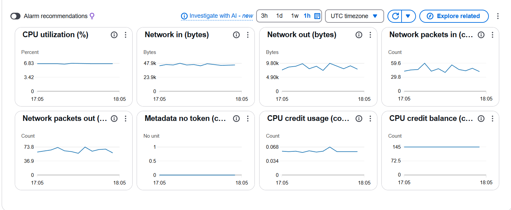
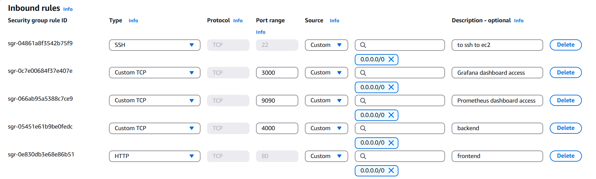

# 🧑‍💻 DockStream

A modern, production-ready MERN stack application with robust **CI/CD**, **Docker-based containerization**, **real-time monitoring**, and **cloud deployment** using **AWS EC2**.

> 🚀 Designed for speed, reliability, and visibility using best DevOps practices.

 

## 📌 Features

✅ Full-stack MERN application  
✅ Dockerized using multi-container setup (client, server, MongoDB)  
✅ GitHub Actions CI/CD pipeline  
✅ Deployed on AWS EC2 with SSH automation  
✅ Monitoring using Prometheus, Grafana, and AWS CloudWatch  
✅ Custom network, reverse proxy, auto-restart, and logging configured

---

## 🖼️ Screenshots

 Cloudwatch dashboard | Opened Ports on EC2
    

> 🔍 Place your actual screenshots in a `screenshots/` folder.

---

## 🗂 Project Structure
```
mern-devops/
├── client/ # React frontend
│ ├── Dockerfile
│ └── ...
├── server/ # Node.js + Express backend
│ ├── Dockerfile
│ └── ...
├── monitoring/ # Prometheus + Grafana config
│ ├── prometheus.yml
│ └── grafana/
├── nginx/ # NGINX reverse proxy config
│ └── default.conf
├── docker-compose.yml # Multi-container definition
├── .github/workflows/ # GitHub Actions CI/CD pipeline
├── .env # Environment variables
└── README.md

```


---

## ⚙️ Run the App Locally (Dockerized)

```bash
# 1. Clone the repository
git clone https://github.com/yourusername/mern-devops.git
cd mern-devops

# 2. Create a .env file (sample provided as .env.example)

# 3. Build and start the application
docker-compose up --build

s

📡 Deployment Architecture
```
Client (React)
   ↓
Express API (Node.js)
   ↔ MongoDB (Docker Volume)
   ↓
AWS EC2 (Ubuntu)
   ↑
CI/CD: GitHub Actions
   ↑
Monitoring: Prometheus + Grafana
```
📈 Performance Metrics
```
🚀 CI/CD Runtime: ~49 seconds

⚙️ CPU Usage: ~9.98% average during load

📉 Manual Deployment Effort: Reduced by 100%

🔍 100% Uptime with automatic container restart on crash
```

👨‍💻 Author
```
Vishal Maurya
📍 Final Year | IIIT Bhopal
```

Star 🌟 this repository if you find it useful!


